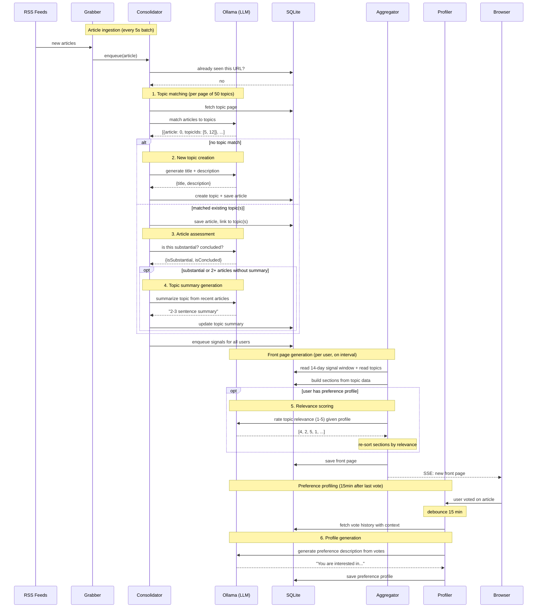

# newsagg

A personal news aggregator that uses local LLMs to classify RSS articles into topics, track ongoing stories, and generate a personalized front page.

This is a hobby project born out of curiosity: how well can LLMs handle data classification and aggregation tasks? The answer, at least with [Gemma 4 31B (Q4_K_M)](https://ollama.com/library/gemma4:31b-it-q4_K_M) running locally via Ollama, turns out to be: surprisingly well.

## How it works

1. **Grab** — polls RSS feeds for new articles
2. **Consolidate** — an LLM matches each article to existing topics (or creates new ones), detects when a story has substantial new developments, and generates topic summaries
3. **Aggregate** — builds a personalized front page per user, optionally ranking topics by relevance using an LLM-generated preference profile
4. **Profile** — learns what you care about from thumbs up/down votes and generates a preference description the LLM can reason about

Articles can belong to multiple topics. Topics accumulate over time with summaries that update as stories develop. Users mark topics as read and they disappear from the front page.

### LLM usage

Every box marked LLM is a separate call to Ollama. All responses are JSON (except summaries and preference profiles which are plain text).



## Stack

- **Runtime**: Node.js (v22.5+)
- **Language**: TypeScript
- **LLM**: [Ollama](https://ollama.com/) via OpenAI-compatible API (any model that can output JSON)
- **Database**: SQLite via `node:sqlite` (zero external dependencies)
- **HTTP**: Fastify
- **Frontend**: SvelteKit (static SPA) + Tailwind CSS v4
- **Real-time**: Server-Sent Events for live front page updates

Single process, single SQLite file, no message queues, no external databases. Ollama is the only dependency outside of Node.js.

## Setup

### Prerequisites

- Node.js 22.5+
- [Ollama](https://ollama.com/) with a model pulled (e.g. `ollama pull gemma4:31b-it-q4_K_M`)

### Install and run

```bash
npm install
cd ui && npm install && cd ..

# Create your config from the template
cp config.example.json config.json
# Edit config.json — at minimum, set your RSS feeds and Ollama model

# Development
npm run dev          # backend with hot reload
cd ui && npm run dev # frontend dev server (proxies API to backend)

# Production
npm run build
npm start
```

### Production ops

```bash
./start.sh    # daemonize (nohup), logs to newsagg.log
./stop.sh     # stop via pidfile
./rebuild.sh  # build UI + compile backend
./restart.sh  # stop + rebuild + start
```

### First use

Set `"registrationEnabled": true` in `config.json`, start the app, and register a user. You can disable registration after.

## Configuration

All config lives in `config.json` (gitignored). See [`config.example.json`](config.example.json) for the template.

| Key | Description |
|-----|-------------|
| `feeds` | Array of RSS feed URLs |
| `ai.url` | Ollama API URL (default: `http://localhost:11434/v1`) |
| `ai.model` | Model name as shown in `ollama list` |
| `ai.maxContextTokens` | Max input tokens for prompt sizing |
| `aggregator.intervalMs` | How often to regenerate front pages per user |
| `aggregator.workers` | Concurrent front page generation workers |
| `server.port` | HTTP port |
| `server.registrationEnabled` | Allow new user registration |

## License

MIT
